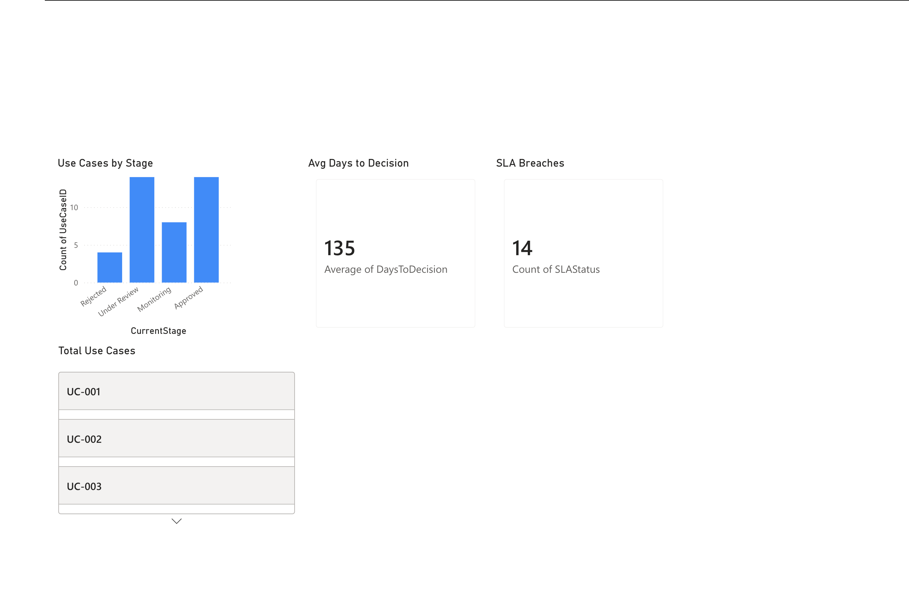

# AI Governance & Reporting Dashboard (Power BI)

## Project Overview

This project demonstrates a prototype AI governance lifecycle dashboard built using Power BI (Web).  

The dashboard models how a financial institution or regulated enterprise might operationalize AI governance by tracking AI use-cases through structured lifecycle stages while enforcing compliance controls such as privacy review, legal review, risk classification, and SLA monitoring.

The objective is to simulate governance visibility at both operational and executive levels.

---

## Governance Lifecycle Model

Each AI use-case progresses through a defined governance workflow:

Intake → Under Review → Approved / Rejected → Monitoring

Each use-case requires completion of the following governance controls:

- Privacy Review
- Legal Review
- Risk Classification (Low / Medium / High)
- SLA Compliance (Decision within 14 days)

This model reflects common AI risk management practices aligned with regulatory expectations (e.g., model risk governance, responsible AI frameworks, internal audit traceability).

---

## Dataset Structure

The mock dataset includes the following fields:

- `UseCaseID`
- `BusinessUnit`
- `CurrentStage`
- `IntakeDate`
- `DecisionDate`
- `DaysToDecision`
- `PrivacyReview`
- `LegalReview`
- `RiskLevel`
- `SLAStatus`
- `StageOrder`

Derived metrics are calculated directly within Power BI using built-in aggregations.

---

## Metrics & Visualizations

The dashboard includes the following components:

### 1. Use Cases by Stage (Bar Chart)
- Aggregation: Count of `UseCaseID`
- Grouped by `CurrentStage`
- Sorted using `StageOrder` (ascending)

### 2. Average Days to Decision (Card)
- Aggregation: Average of `DaysToDecision`
- Measures operational efficiency

### 3. SLA Breaches (Card)
- Aggregation: Count of `SLAStatus`
- Visual-level filter: `SLAStatus != Within SLA`
- Provides compliance risk visibility

### 4. Total Use Cases (Table)
- Displays individual `UseCaseID`
- Enables drill-down visibility into portfolio inventory

---

## Key Insights (Sample Data)

- 14 use-cases breached the 14-day SLA threshold
- Average time-to-decision: 135 days
- Majority of cases are currently Under Review or Approved
- Governance bottlenecks may exist prior to approval stage

---

## Technical Implementation Notes

- Power BI Web semantic model used
- Visual-level filtering applied for SLA breach isolation
- Aggregations configured manually (Count / Average)
- Custom stage sorting implemented using `StageOrder`
- Structured repository documentation for reproducibility

---

## Tools Used

- Power BI (Web)
- Excel (Mock Governance Dataset)

---

## Repository Structure

ai-governance-reporting-dashboard/
├── data/
├── reports/
├── screenshots/
│ └── dashboard.png
├── documentation/
│ └── Project_Overview.md
└── README.md

---

## Dashboard Preview

---

## Future Enhancements

- Add DAX measures for SLA percentage compliance
- Implement Business Unit slicers
- Introduce trend analysis (Intake volume over time)
- Add drill-through capability for individual case analysis
- Expand to multi-page governance reporting suite

---

## Purpose

This project demonstrates practical implementation of AI governance reporting concepts using business intelligence tooling. It is intended as a portfolio artifact for roles in:

- AI Governance
- Model Risk Management
- Risk & Compliance Analytics
- Security & Governance Engineering
- Enterprise Data Analytics

